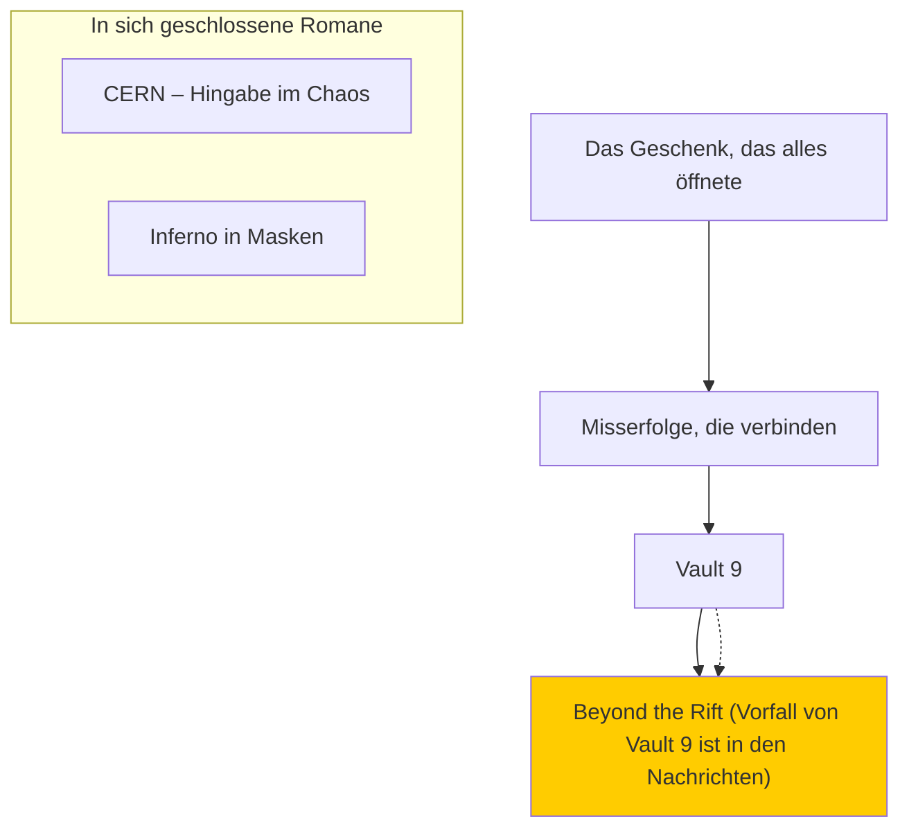

# Romane
Dieses Repository ist ein Projekt wo ich (Raphael Oberhummer) meine Romanprojekte speichere. Jeder Roman hat seinen eigenen Branch und der main-Branch besitzt alle Informationen (Filme, Bücher, Ereignisse, etc.), welche in allen Romanen vorkommen oder referenziert werden. Es kann vorkommen, dass sich aus diesen Überschneidungen eigene Romane entstehen, oder einige Romane als Referenzen in den main-Branch kommen, da diese im gleichen Universum spielen.
Wenn die einzelnen Romane fertig geschrieben sind, werden sie mit dem main-Branch gemerched.
Die Namen der Ausgangsromane können sich während des Schreibens ändern, jedoch wird dieser Name erst dann geändert, wenn dieser Roman fertig ist und mit dem main-Branch gemerched wird.

## Legende des Status der Projekte

🟢 Aktiv

🟡 Pausiert

🔴 Überarbeitung

⚪ Konzeptphase

🔵 Abgeschlossen

## Aktuelle Projekte
- 🟢 Das Geschenk, das alles öffnete - Coming-of-Age-Roman über zwei Mädchen, die sich über ein Wichtelgeschenk näherkommen.
- 🟡 Misserfolge, die verbinden - Soft-Romance über ein D/s-Paar, das ein chaotisches, warmherziges Wochenende erlebt.
- 🟡 Vault 9 - Cybercrime-Thriller mit Switch-Dynamik zweier Ermittlerinnen.
- 🟡 CERN - Hingabe im Chaos - Magie bricht in die Welt ein; ein Mann kämpft mit Devotion und Identität.
- 🟡 Inferno in Masken - Dämonen-Invasion mit spirituellem Twist.
- 🟡 Beyond the Rift - Sci-Fi-Epos über eine Crew, die durch eine Raum-Zeit-Anomalie in die Andromeda-Galaxie gerät.

Der farblich markierte Roman ist der, der in diesem Branch bearbeitet wird.

## Wichtige Hinweise
Die Markdown-Datein außerhalb der README.md KÖNNEN Spoiler enthalten.

Die Romane werden in den odt Datein gepeichert. Diese wurden in LibreOffice geschrieben, können aber auch in Microsoft Word, Google Docs und ähnlichen Programmen geöffnet werden, jedoch kann sich dabei die Seitenanzahl verändern. Da es keine relevanten Formatierungen (Es sind nur unterschieliche Schriftgrößen, fett und kursiv geschriebene Schrift vorhanden) eingebunden wurden, ist die potentielle Formatierungsänderung bei aufwendigeren Formatierungen irrelevant.